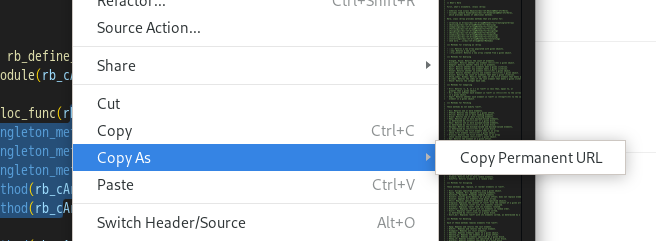

# copy-permanent-url

A Visual Studio Code extention for copying permanent URL.

## Requirements

- [dpu](https://github.com/nishidayuya/dpu) : To determine permanent URL

## Extension Settings

Nothing.
